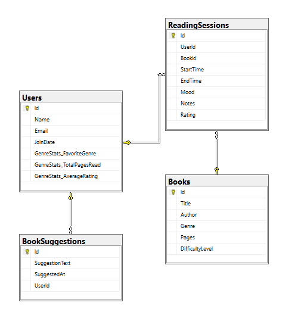

# BookMate (Reading Tracker Console App)

A EF Core Console Application that tracks users’ reading habits, sessions, moods, and suggestions.
It’s designed to help you apply all the important concepts in **Entity Framework Core** practically and efficiently.

---

## Technologies Used

- C# & .NET
- Entity Framework Core
- Code First Approach
- SQL Server
- Console UI

---

## Key Features

- Track multiple **users**, their reading **sessions**, and **suggestions**
- Log moods, notes, ratings during sessions
- **Books** categorized by genre and difficulty
- User’s reading performance stored in an **owned type** (`GenreStats`)
- Uses both **Fluent API**
- Includes **manual seeding** of data

---

## Entities Overview

### `User`

- `Id`, `Name`, `Email`, `JoinDate`
- `GenreStats`: FavoriteGenre, TotalPagesRead, AverageRating (Owned Type)
- Navigation: `List<ReadingSession>`, `List<BookSuggestion>`

### `Book`

- `Id`, `Title`, `Author`, `Genre`, `Pages`, `DifficultyLevel` (Enum)
- Navigation: `List<ReadingSession>`

### `ReadingSession`

- `Id`, `UserId`, `BookId`
- `StartTime`, `EndTime`, `Mood` (Enum), `Notes`, `Rating`

### `BookSuggestion`

- `Id`, `UserId`, `SuggestionText`, `SuggestedAt`

---

## Relationships

- **One-to-Many**:  
  `User → ReadingSessions`  
  `User → BookSuggestions`  
  `Book → ReadingSessions`

- **Owned Type**:  
  `User → GenreStats`

---

## Database Schema

The following ERD was generated in SQL Server:



---

## Seeding Notes

EF Core doesn't support `.HasData()` with owned types like `GenreStats`.  
So the initial data is seeded manually in the `Main` method using:

```csharp
context.Database.EnsureCreated();
context.Users.AddRange(SeedData.GetUsers());
context.SaveChanges();
```
